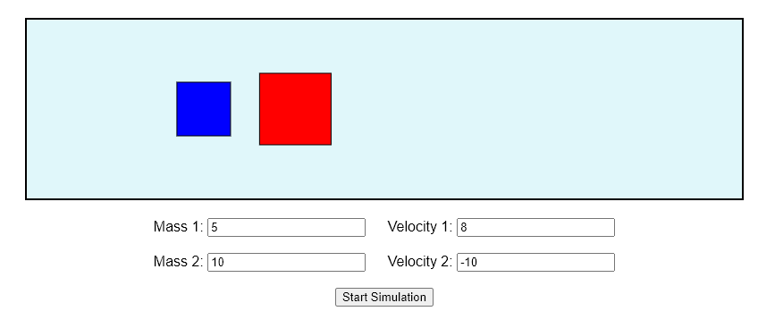

# ⚙️ 1D Elastic Collision Simulator

A browser-based physics simulation that models **1D elastic collisions** between two objects (like boats) moving along a straight path. The simulation includes **user-configurable mass and velocity**, **wall bouncing**, and realistic physics-based velocity updates after collisions.

---

## 🖼️ Preview

  
*(Add a screenshot of your simulation running here)*

---

## 🚀 Features

- 🛶 Two object simulation in 1D space
- 🎯 Real-time elastic collision physics
- 📊 User inputs for:
  - Mass of both objects
  - Initial velocities (positive or negative)
- 🔁 Repeated collisions with each other and walls
- 🧮 Physics engine using momentum & energy conservation

---

## ⚡ Live Demo

👉 [Click here to try it live](https://yourusername.github.io/elastic-collision-simulator)

*(Replace with your actual GitHub Pages/Netlify link)*

---

## 🧪 How It Works

1. The simulation runs in a `<canvas>` element.
2. Objects move according to initial velocity.
3. When they collide, new velocities are calculated using:
v1 = [(m1 - m2) * u1 + 2 * m2 * u2] / (m1 + m2)
v2 = [(m2 - m1) * u2 + 2 * m1 * u1] / (m1 + m2)

yaml
Copy
Edit
4. They also bounce off walls (velocity is reversed).
5. The update loop uses `setInterval()` to animate at ~33 FPS.

---

## 🛠️ Tech Stack

- HTML5 Canvas
- Vanilla JavaScript
- CSS

---

## 💡 Potential Extensions

- Add kinetic energy and momentum visualization
- Show graphs of velocity over time
- Pause/Resume buttons
- Support for inelastic collisions
- Add labels for velocity/mass on each object
- Convert to 2D collision version

---
